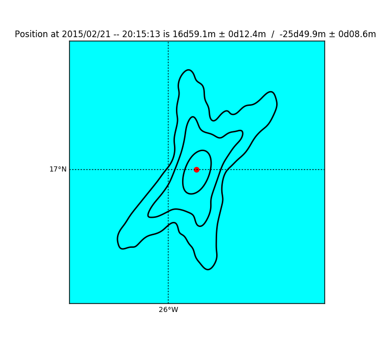

# Bayesian Celestial Navigation

This package uses Markov Chain Monte Carlo (MCMC) methods to infer a positional fix using readings from a marine sextant.

I created this project to teach myself basic celestial navigation techniques well enough to solve a set of celestial navigation exercises on a blog I found: [Celestial Navigation Practice Problems](https://celestialnavproblems.wordpress.com)

Traditionally, a line of position (LOP) is calculated from a sextant sighting that has been corrected for various errors (e.g. atmospheric refraction). A single measurement determines a circle on the Earth's surface on which the observer must lie, and over short distances, this circle is simply a line. If two different LOPs from two different celestial objects can be determined, then the observer should lie at their intersection point. This is called a positional fix. If only one measurement can be taken (e.g. during the day, when only the sun is visible) or the measurements are taken more than a few tens of minutes apart, a second kind of fix called a `running fix' can be used to estimate the observer's position. In this scenario, an estimate of the ship's position based on dead reckoning, combined with the available LOPs, can produce a rough estimate of the observer's position.

Mainly, I wanted to get a very quantitative picture of the precision limits of celestial navigation. Specifically:

* Can a series of Sun sights be used with only weak prior information to obtain a good fix of lattitude *and* longitude?
* What does the posterior distribution of a positional fix using two celestial objects look like? Nominally, it should look like a sort of "cross" where the lines of position cross -- I'd like to visualize that.
* Given a pair of stars for such a positional fix, what is the relation between how precise one can measure angle with a sextant and how precisely one's location can be determined from that information?

While writing this code, I found Rodger E. Farley's '[The Armchair Celestial Navigator](http://www.dacust.com/navigation/pdf/ArmchairCelestialNavigator.pdf)' to be a great practical resource for navigating via sextant.

## Getting Started

This is a small project that's for my own exploration, so all of the analysis subfunctions are stored in a single file (bayescelestial.py). The simulated sextant sightings are read in from blocks of strings stored there, as well; this isn't pretty, but it made for quick exploratory analysis.

### Prerequisites

Beyond the standard numpy, scipy, and matplotlib packages, this package requires:

astropy -- does lattitude/longitude computations

pyephem -- performs basic astronomical calculations. Most importantly, this is used to compute the Global Hour Angle (GHA) and Declination (DEC), which are the main quantities used in determining the expected object location in the sky, and other quantities like the semi-diameter of the Moon, which must be taken into account for accurate position fixing.

emcee -- performs Markov Chain Monte Carlo simulations. These are the main interest of the package, as they are used for statistical inference of a position given the sextant sightings and GHA/DEC data from pyephem.

## Results

Position plots: The red dot indicates the true position given by the navigation blog, and the black curves are the contours of the posterior probability distribution at the 68%, 95%, and 99% probability levels, as determined via the MCMC simulation.

A classical positional fix from two star sightings:

A positional fix from 13 lower-limb Sun sightings, taken in quick succession (~35 minutes):

A positional fix from six lower- and upper-limb Sum sightings, taken in two sets separated by 4 hours:

